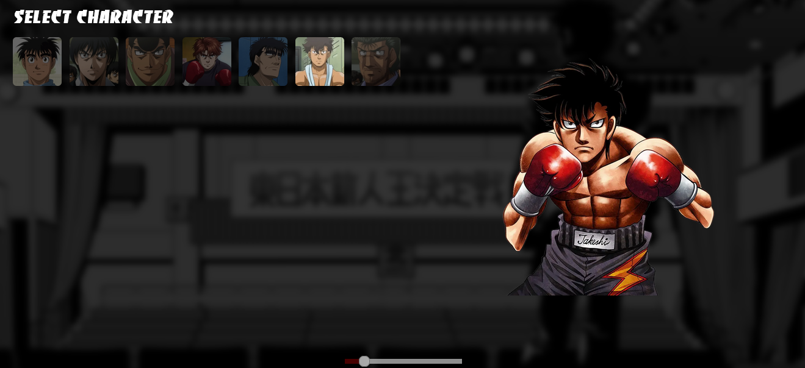

# Seleção de Personagens - Projeto Next.js

Este é um projeto de exemplo que demonstra a implementação de uma seleção de personagens em uma aplicação Next.js. O projeto inclui as seguintes funcionalidades:

## Funcionalidades Implementadas

1. **Exibição de Personagens**: A aplicação exibe uma lista de personagens com seus nomes e imagens.

2. **Seleção de Personagens**: Os usuários podem selecionar um personagem clicando nele. O personagem selecionado é destacado com uma cor de fundo.

3. **Renderização de Imagem Selecionada**: Quando um personagem é selecionado, uma imagem maior e seu nome são renderizados ao lado da lista de personagens para exibir detalhes do personagem selecionado.

4. **Controle de Volume**: Um controle deslizante de volume permite aos usuários ajustar o volume da música de fundo.

5. **Reprodução de Música de Fundo**: A aplicação reproduz uma música de fundo em loop. O volume da música pode ser ajustado pelos usuários.

## Tecnologias Utilizadas

- React: A aplicação é desenvolvida com React para criar componentes reutilizáveis e gerenciar o estado.

- Next.js: O projeto é construído com Next.js para facilitar o roteamento e a criação de páginas no lado do servidor.

- Tailwind CSS: O Tailwind CSS é usado para estilizar os componentes da aplicação de forma eficiente.

## Como Executar o Projeto

1. Clone este repositório:

   ```bash
   git clone https://github.com/seu-usuario/selecao-de-personagens-nextjs.git
2. Instale as dependências:

       yarn install

3. Inicie o servidor de desenvolvimento:

       yarn dev

4. Acesse a aplicação em seu navegador em http://localhost:3000.

# Autor

DevMarcosEd

